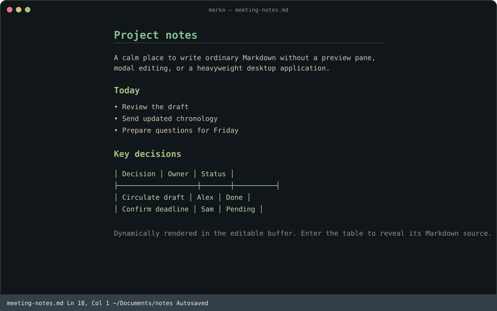
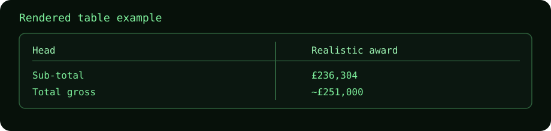

# Marko

**A calm, modeless Markdown editor for the terminal.**

Marko combines the best bits of `pencil`-style writing and Goyo-style focus with **dynamic inline Markdown rendering**. Headings, emphasis, lists, and tables render cleanly inside the terminal; move your cursor into them and their editable Markdown source reappears instantly.

There is no preview pane, no modal editing, no notes database, and no workspace to manage. Your files remain ordinary Markdown.



### Sample graphics



The screenshot shows both states: a rendered table in the editor and the raw Markdown source that appears when you enter it. There is no preview pane.

## Why Marko?

Terminal Markdown tools often force a compromise: a raw plain-text editor, a separate read-only viewer, or a powerful modal editor with a steep learning curve. Marko bridges the gap. It is built for writers who love terminal efficiency but want a calm, visually polished environment that respects the layout of their document.

- **Write in Place**: Read dynamically rendered headings, emphasis, list markers, and beautifully aligned tables directly in the editor buffer. Step into them to edit their raw Markdown syntax.
- **True Focus Mode**: Highlight the current active paragraph, table, list item, or code block while smoothly dimming the surrounding context (Vim Goyo-style).
- **Auto-Sync & Live Reload**: Perfect for hybrid workflows. Marko automatically detects external file changes (like edits made by AI tools or external scripts) and live-reloads your document instantly while preserving your precise scroll position and cursor location.
- **Natural Visual Navigation**: Arrow keys navigate visually on wrapped prose lines rather than physical source lines, matching the intuitive feel of GUI editors.
- **Rich Terminal Integration**: Full support for trackpad/mouse-wheel scrolling, double-click word selection, triple-click line selection, cross-platform clipboard syncing (`Ctrl-C`/`Ctrl-V`), and bracketed paste protection.

## Quick Start

```sh
marko                 # new dated note in the current directory (YYYYMMDD_untitled.md)
marko document.md     # open or create a named Markdown file
```

Documents autosave after two idle seconds. Press `F1` inside Marko for the complete shortcut overlay.

## Features We Are Proud Of

### 💡 Dynamic Inline Markdown Rendering
- **Aligned Tables**: Markdown tables instantly format into clean, boxed unicode tables. Pressing `Tab` moves through cells, `Enter` inserts new rows, and stepping out preserves the formatting.
- **Fenced Code Blocks**: Raw code blocks fold into visually distinct boxes with calm language labels. Stepping inside reveals the code, and stepping out hides the syntax.
- **Emphasis & Headers**: Headers are styled and clean, and bold, italic, or strikethrough markdown markers disappear inline unless you are actively editing that line.
- **Interactive Checkboxes**: Toggle lists and markdown checkboxes `[ ]` / `[x]` instantly using `Ctrl-Space`.

### 🎯 Intelligent Focus Mode
Focus mode (`Ctrl-G` cycles themes, and inactive time triggers Goyo focus) doesn't just dim lines blindly. It parses Markdown structure:
- If you're on a paragraph, it highlights the paragraph and dims everything else.
- If you enter a table, the entire table remains beautifully lit.
- If you write code, the entire code block stays visible.
- It respects headers, list structures, and blockquotes, keeping your immediate workspace clear and isolated.

### 🔄 Asynchronous External Syncing
Marko works perfectly alongside external automations, scripts, or AI assistants. The editor watches the underlying file on a 500ms heartbeat. If an AI writes an update to the file in the background, Marko instantly reloads the buffer and redraws your screen, keeping your cursor and scroll viewport exactly where you left them.


## Essential Keys

| Key | Action |
|---|---|
| `F1` | Show shortcut help |
| `Ctrl-S` / `Ctrl-Shift-S` | Save / Save As |
| `Ctrl-E` | Open recent Markdown file |
| `Ctrl-F` / `Ctrl-N` / `Ctrl-P` | Search / next / previous |
| `Ctrl-R` | Replace current; `Ctrl-A` in prompt replaces all |
| `Ctrl-Z` / `Ctrl-Y` | Undo / redo |
| `Ctrl-C` / `Ctrl-X` / `Ctrl-V` | Copy / cut / paste |
| `Ctrl-T` | Create table |
| `Ctrl-G` | Cycle theme |
| `Ctrl-Q` | Quit |

## Install

Download the appropriate binary from [GitHub Releases](https://github.com/anmacmillan/marko/releases), rename it to `marko`, make it executable, and place it on your `PATH`.

Or build from source:

```sh
go install github.com/alexandermacmillan/little-marco@latest
```

## Themes And Fonts

```sh
MARKO_THEME=green marko document.md
MARKO_THEME=mono marko document.md
MARKO_THEME=light marko document.md
```

Press `Ctrl-G` to cycle and remember themes. Marko inherits your terminal font; for a warmer writing feel, try Berkeley Mono, iA Writer Mono, or Atkinson Hyperlegible Mono in your terminal settings.

## Philosophy

Marko is intentionally small. It focuses on rendering the Markdown structures that matter most for everyday writing while keeping your underlying text readable, portable, and standard. Features that turn it into an IDE, file manager, or proprietary notes system are outside its scope.
